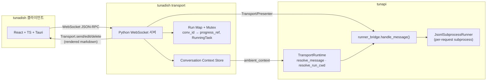

~/.codex/instructions.md ~/AGENTS.md# tunaDish 개발 계획

> 버전: v4
> 작성일: 2026-03-20
> 기반 문서: `docs/briefing.md`, `docs/prd.md`
> 리뷰: Codex 3회 반복 리뷰 반영 (tunapi 소스 기반 검증)

---

## 1. 설계 전제 (tunapi 실제 구조 기반)

| 항목              | tunapi 실제 동작                                                        | tunadish 설계 반영                  |
| ----------------- | ----------------------------------------------------------------------- | ----------------------------------- |
| 에이전트 실행     | 요청마다 CLI subprocess 생성/종료 (`JsonlSubprocessRunner`)             | run 단위 실행/취소 모델             |
| 메시지 파이프라인 | `handle_message()` → `Presenter.render_*()` → `Transport.send/edit()`   | 클라이언트는 rendered markdown 수신 |
| 세션              | `channel_id + engine → ResumeToken` (`ChatSessionStore`)                | `conversation_id + engine` 매핑     |
| 프로젝트 config   | `tunapi.toml → ProjectsConfig → TransportRuntime`                       | tunapi.toml이 source of truth       |
| cwd 설정          | `set_run_base_dir(cwd)` → subprocess 실행 → `reset_run_base_dir(token)` | Telegram executor.py 패턴 준수      |
| 스트리밍          | progress/action 이벤트 (5초 주기), 최종 답변은 `CompletedEvent`         | 토큰 스트리밍 아님                  |
| ProgressTracker   | `handle_message()` 내부 로컬 객체, 외부 구독 불가                       | MVP에서 구조화 이벤트 포기          |

---

## 2. 전체 구조



---

## 3. 핵심 설계 결정

### 3.1 MVP: rendered markdown only (확정)

클라이언트가 받는 것은 Presenter가 렌더링한 마크다운 문자열.
`ProgressTracker`는 `handle_message()` 내부 로컬 객체라 외부 transport에서 구독 불가.
구조화 이벤트(action 목록, usage 등)는 **MVP에서 제공하지 않음**.

Phase 2 접근법: custom `handle_message` wrapper, `runner_bridge` 확장, 또는 tunapi core patch 필요.

### 3.2 Per-conversation mutex (확정)

`handle_message()`는 코루틴 내부에서만 blocking이므로, WS 서버가 요청마다 task를 띄우면 같은 `conversation_id`로 여러 run이 동시에 들어갈 수 있음.

```python
# 정책: 같은 conversation에서 run 1개만 허용
# 새 요청이 들어오면 기존 run이 끝날 때까지 대기 or 에러 반환(409)
self._conv_locks: dict[str, anyio.Lock] = {}

async def handle_chat_send(self, params):
    conv_id = params["conversation_id"]
    lock = self._conv_locks.setdefault(conv_id, anyio.Lock())
    if lock.locked():
        return {"error": {"code": -32001, "message": "run already in progress"}}
    async with lock:
        await self._execute_run(conv_id, params)
```

### 3.3 run_map 채우기: progress_ref 선할당 (확정)

`handle_message()`는 `progress_ref` 파라미터를 받음 (L482).
transport에서 progress placeholder 메시지를 먼저 만들고, 그 ref로 run_map을 채운 뒤 handle_message에 전달.

```python
async def _execute_run(self, conv_id: str, params):
    # 1. progress placeholder 선할당
    progress_ref = await self.transport.send(
        channel_id=conv_id,
        message=RenderedMessage(text="⏳ starting..."),
        options=SendOptions(notify=False),
    )

    # 2. run_map에 등록 (cancel이 가능해짐)
    running_task = RunningTask()
    if progress_ref is not None:
        self.running_tasks[progress_ref] = running_task
        self.run_map[conv_id] = progress_ref

    # 3. context + cwd 해석
    ambient_ctx = await self.context_store.get_context(conv_id)
    resolved = runtime.resolve_message(
        text=params["text"],
        reply_text=None,
        ambient_context=ambient_ctx,
    )
    cwd = runtime.resolve_run_cwd(resolved.context)
    run_base_token = set_run_base_dir(cwd)

    try:
        # 4. handle_message에 선할당된 progress_ref 전달
        await runner_bridge.handle_message(
            cfg=ExecBridgeConfig(
                transport=self.transport,
                presenter=self.presenter,
                final_notify=False,
            ),
            runner=rr.runner,
            incoming=IncomingMessage(channel_id=conv_id, ...),
            resume_token=resolved.resume_token,
            context=resolved.context,
            running_tasks=self.running_tasks,
            progress_ref=progress_ref,   # ★ 선할당된 ref
        )
    finally:
        reset_run_base_dir(run_base_token)
        self.run_map.pop(conv_id, None)  # 완료/취소 시 정리
```

### 3.4 용어 정리 (확정)

| 용어                | 정의                                                      |
| ------------------- | --------------------------------------------------------- |
| **프로젝트**        | tunapi.toml의 프로젝트 (코드 디렉토리, `ProjectConfig`)   |
| **Conversation**    | tunadish 대화 단위, UUID, tunapi `channel_id`에 매핑      |
| **Run**             | `handle_message()` 1회 실행 = subprocess 1개              |
| **ambient_context** | Conversation → 프로젝트 연결 (`RunContext`), 매 요청 주입 |

---

## 4. Sprint 구성

### Sprint 0: 레포 구조 + 스캐폴딩

| 작업                   | 상세                                                   |
| ---------------------- | ------------------------------------------------------ |
| 모노레포 구조          | `client/`, `transport/`, `docs/`                       |
| Tauri + React 스캐폴딩 | React + TS + shadcn/ui + Zustand                       |
| Python 패키지          | `transport/src/tunadish_transport/` + `pyproject.toml` |
| entry_point 등록       | `tunapi.transport_backends` → `tunadish`               |

**완료 기준**: `npm run dev`로 Tauri 윈도우, `pip install -e .`로 transport 인식

---

### Sprint 1: Transport 코어

**목표**: tunapi 인터페이스 3개 구현 + WebSocket rendered message push + run 취소

#### 인터페이스 구현

```python
# TunadishTransport — rendered message를 WS로 relay
class TunadishTransport:
    async def send(self, *, channel_id, message, options=None) -> MessageRef | None
    async def edit(self, *, ref, message, wait=True) -> MessageRef | None
    async def delete(self, *, ref) -> bool
    async def close(self) -> None

# TunadishPresenter — 직접 구현 필요 (presenter.py는 프로토콜 정의만)
# Mattermost/Slack Presenter 구현체 참고
class TunadishPresenter:
    def render_progress(self, state, *, elapsed_s, label) -> RenderedMessage
    def render_final(self, state, *, elapsed_s, status, answer) -> RenderedMessage

# TunadishBackend — build_and_run에서 WS 서버 시작 + runtime 활용
class TunadishBackend:
    id = "tunadish"
    def build_and_run(self, *, transport_config, config_path,
                      runtime: TransportRuntime, ...) -> None
```

#### 메시지 수신 흐름 (순서 확정)

```
1. per-conversation mutex 획득
2. progress placeholder 선할당 → Transport.send()
3. run_map[conv_id] = progress_ref 등록
4. context_store.get_context(conv_id) → ambient_context
5. runtime.resolve_message(text, ambient_context=ambient_ctx)
6. runtime.resolve_run_cwd(context) → cwd
7. set_run_base_dir(cwd)
8. handle_message(cfg, runner, incoming, progress_ref=progress_ref, ...)
9. reset_run_base_dir(token)
10. run_map.pop(conv_id)
11. mutex 해제
```

#### JSON-RPC methods

| method           | 방향          | 설명                                                |
| ---------------- | ------------- | --------------------------------------------------- |
| `chat.send`      | Client→Server | 메시지 전송 → run 시작                              |
| `run.cancel`     | Client→Server | `run_map[conv_id]` → `RunningTask.cancel_requested` |
| `message.new`    | Server→Client | Transport.send() — 새 메시지                        |
| `message.update` | Server→Client | Transport.edit() — progress 갱신                    |
| `message.delete` | Server→Client | Transport.delete()                                  |
| `run.status`     | Server→Client | idle / running / cancelling                         |

#### Run 취소

```python
async def handle_run_cancel(self, params):
    conv_id = params["conversation_id"]
    progress_ref = self.run_map.get(conv_id)
    if progress_ref is None:
        return {"error": {"code": -32002, "message": "no active run"}}
    task = self.running_tasks.get(progress_ref)
    if task is not None:
        task.cancel_requested.set()
    return {"result": "ok"}
```

#### Conversation Context Store

```python
# ChatPrefsStore 패턴 (channel_id 기반 ambient context)
# 저장: ~/.tunapi/tunadish_context.json
{
  "conversations": {
    "<conv_id>": {
      "project": "myproject",
      "branch": null
    }
  }
}

class ConversationContextStore:
    async def get_context(self, conv_id: str) -> RunContext | None
    async def set_context(self, conv_id: str, context: RunContext) -> None
    async def clear(self, conv_id: str) -> None
```

> MVP에서 `default_engine` 필드는 포함하지 않음. 엔진 선택은 tunapi.toml의 프로젝트별 `default_engine`과 directives(`@claude`, `@gemini` 등)로 처리. Conversation별 엔진 고정은 Phase 2에서 ChatPrefsStore 확장으로 대응.

**완료 기준**: `tunapi run --transport tunadish` → WS 서버 → `chat.send` → rendered markdown 수신 + `run.cancel` 동작

---

### Sprint 2: 클라이언트 기본 레이아웃 + WebSocket 연결

**목표**: 3패널 레이아웃 + rendered message 수신/표시

#### 레이아웃

```
+----------+--------------------+-------------+
| 사이드바  | 채팅 메인           | 컨텍스트 패널 |
+----------+--------------------+-------------+
```

#### Zustand 스토어

```typescript
interface RunStore {
  activeRuns: Record<string, "idle" | "running" | "cancelling">;
  cancelRun: (conversationId: string) => Promise<void>;
}

interface ChatStore {
  messages: Record<string, RenderedMessage[]>;
}
```

#### 메시지 표시

- `message.new` → 새 블록 추가 (마크다운 렌더링)
- `message.update` → in-place 교체 (progress 갱신, 5초 주기)
- `message.delete` → progress 제거
- 토큰 스트리밍 없음

**완료 기준**: 앱 → WS 연결 → `chat.send` → progress + 최종 응답 표시

---

### Sprint 3: 프로젝트 + Conversation 관리

**목표**: tunapi.toml 기반 프로젝트 + Conversation CRUD

#### Config 재빌드 경로 (확정)

```python
# tunapi.toml 변경 감지 시:
settings = TunapiSettings.from_toml(config_path)
spec = build_runtime_spec(settings=settings, config_path=config_path)
spec.apply(runtime, config_path=config_path)
# → runtime 내부 router/projects/plugin_configs 교체
```

- MVP: 읽기 전용 (tunapi.toml 기존 프로젝트만 표시)
- Phase 2: UI에서 tunapi.toml 편집 + 재빌드

#### Conversation 모델

```
프로젝트 (tunapi.toml)
└── Conversation (tunadish 관리)
    ├── conversation_id (UUID) — channel_id 매핑
    ├── project_key — ambient_context.project
    ├── branch — ambient_context.branch (optional)
    └── 세션: engine → ResumeToken
```

- 생성 시: `context_store.set_context(conv_id, RunContext(project=key))`
- 매 요청 시: `context_store.get_context(conv_id)` → `ambient_context` 주입
- 한 프로젝트에 여러 Conversation 가능

#### 프로젝트 UI

- 사이드바: `runtime.project_aliases()` 기반 목록
- 프로젝트 선택 → Conversation 목록
- 새 Conversation → UUID 발급 + context 저장

**완료 기준**: 프로젝트 선택 → Conversation 생성 → cwd가 프로젝트 경로로 설정된 상태에서 채팅

---

### Sprint 4: 채팅 기능 완성

**목표**: 채팅 UX — progress + 입력창 + 취소

- progress: Presenter 렌더링 마크다운 in-place 갱신 (5초 주기)
- 최종 응답: `render_final()` 결과
- 마크다운 렌더링: `react-markdown` + `remark-gfm` + `rehype-highlight`
- 입력창: Shift+Enter 멀티라인, 파일 첨부, `/` · `!` 커맨드
- 취소: UI 버튼 → `run.cancel` → `RunningTask.cancel_requested.set()`

**완료 기준**: AI 대화 → progress 갱신 → 최종 응답 → 취소 동작

---

### Sprint 5: 세션 + 안정화

**목표**: 세션 재개, 에러 핸들링, 안정화

- 세션: `ChatSessionStore` 패턴 (`conversation_id + engine → ResumeToken`)
- 전용 파일: `~/.tunapi/tunadish_sessions.json`
- WS 재연결 + 상태 복원
- subprocess 에러 → `render_final(status="error")`
- 크로스 플랫폼 테스트

---

## 5. 기술적 리스크

| 리스크                                        | 영향도 | 완화                                          |
| --------------------------------------------- | ------ | --------------------------------------------- |
| ambient_context 누락 → cwd/프로젝트 해석 실패 | 높음   | ConversationContextStore, 매 요청 주입        |
| 동시 run으로 resume/cancel 꼬임               | 높음   | per-conversation mutex (anyio.Lock)           |
| Presenter 렌더링 한계 → 구조화 이벤트 불가    | 중간   | MVP rendered markdown only, Phase 2 core 확장 |
| config 재빌드 비용                            | 중간   | 변경 감지 시에만, MVP 읽기 전용               |
| run cancel 타이밍 (progress_ref 선할당 전)    | 낮음   | placeholder 선할당 후 run_map 등록            |
| Tauri 모바일                                  | 중간   | 데스크탑 먼저                                 |

---

## 6. Phase 2+ 로드맵

| 순서 | 기능                                       | 비고                                            |
| ---- | ------------------------------------------ | ----------------------------------------------- |
| 1    | 구조화 이벤트                              | `handle_message` wrapper 또는 core patch        |
| 2    | 페르소나 (prompt preset) + EngineOverrides | ChatPrefsStore 분리                             |
| 3    | Conversation별 엔진 고정                   | ChatPrefsStore 확장                             |
| 4    | 프로젝트 CRUD UI                           | tunapi.toml 편집 + `build_runtime_spec → apply` |
| 5    | 스킬 · 스니펫                              | 입력창 안정화 후                                |
| 6    | 브랜치/서브대화                            | worktree 연동                                   |
| 7    | 토론 모드                                  | tunapi core 추출 후                             |
